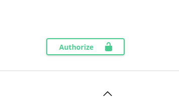

.png)

TamagoAPI is a REST API for managing virtual pets, inspired by classic Tamagotchi. Users can create pets, take care of them (feed, play, put to sleep), and track their action history

## Technology Stack:

* FastAPI - main framework for building the API with asynchronous support
* PostgreSQL - relational database for storing users, pets, and their actions
* SQLAlchemy - ORM for working with the database in Python
* Alembic - database migration management tool
* JWT (JSON Web Tokens) - authentication and endpoint protection

## Key Features:

* User registration and authentication using JWT
* CRUD operations for pets: create, read, update, delete
* Pet actions: feeding, playing, sleeping
* Action history with timestamps for each pet
* Endpoint protection: only owners can access their resources
* Cascade deletion: deleting a user automatically deletes their pets and related actions

## Getting Started:

### 1. Clone the repository

```bash
git clone https://github.com/Marchello-Projects/TamagoAPI_by_Marchello
```

### 2. Create and activate virtual environment (optional but recommended)

```bash
python3 -m venv .venv
source .venv/bin/activate  # On Windows: .venv\Scripts\activate
```

### 3. Install dependencies

```bash
pip install -r requirements.txt
```
### 4. Set up environment variables

Create a `.env` file in the root directory with the following content:

```env
DATABASE_NAME=Database_Name
DB_USER=Database_username
DB_PASSWORD=Database_password
SECRET_KEY=Key_for_JWT
```

> [!NOTE]
> The key can be generated on the website: https://jwtsecrets.com/

### 5. Obtaining JWT Tokens:
Run the project:

```bash
uvicorn main:app --reload
```

Go to the Swagger documentation:

`http://127.0.0.1:8000/docs`

Create a user at `/auth/register`


Next, click **Authorize** and enter your login credentials (username and password)




## Pet Actions API:


| Method | Path | Description |
|--------|------|-------------|
| GET    | /auth/me | Retrieves detailed information about the currently authenticated user's account |
| DELETE | /auth/me | Permanently deletes the account of the currently authenticated user. Requires re-authentication or confirmation |
| POST   | /pets/create | Creates a new pet |
| GET    | /pets/{pet_id} | Retrieves the specific details and current status of the pet identified by {pet_id} |
| PATCH  | /pets/{pet_id} | Applies partial updates to the pet identified by {pet_id} |
| DELETE | /pets/{pet_id} | Permanently removes the pet identified by {pet_id} from the system |
| PATCH  | /pets/{pet_id}/action | Executes a specific action on the pet (e.g., feeding, grooming, playing) defined in the request body |
| GET    | /pets/{pet_id}/actions_history | Retrieves a chronological list of all actions previously performed on the pet identified by {pet_id} |
